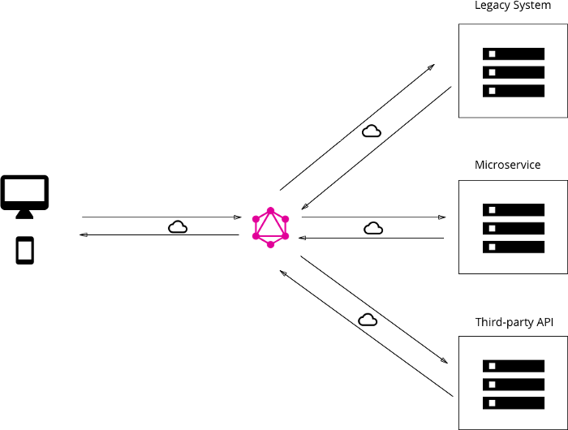
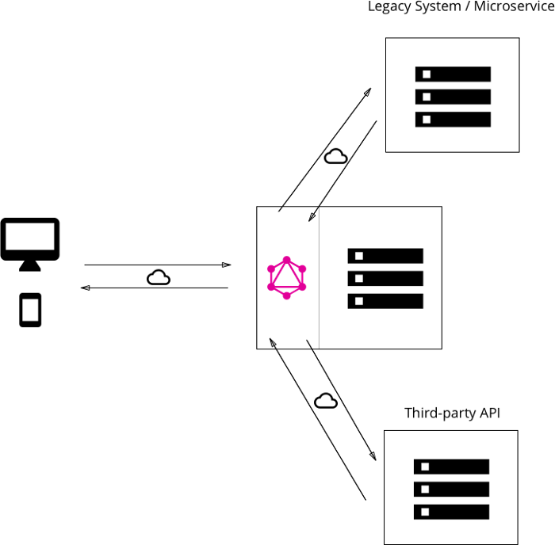

# WORKSHOP - GRAPHQL IN A NUTSHELL

_O que é? Onde mora? O que come?_

## Apresentação da "problemática":

Imagino que muitos aqui já estejam familiarizados com o conceito de API Rest, entretanto, para os que não estão, vou fazer uma breve explicação.

Atualmente temos diversas aplicações serem feitas única e exclusivamente desenvolvidas para rodar na internet, sendo assim _"consumidas"_ por navegadores em desktops, notebooks e dispositos móveis. Nesse contexto, as empresas sentiram a necessidade de alimentar essas aplicações (que iam desde sistemas de estoque, contabilidade, ERP à redes sociais) com dados a todo momento.
Com essas duas problemáticas em mente (sofwares sendo acessados pela Web e empresas precisando alimentar seus sistemas) começou a se pensar em algum tipo de soluçao de software que permitisse essa conversa entre sistema e usuários.
Durante anos, diversas alternativas surgiram e, de uma forma geral, essas aplicações ficaram conhecidas como **APIs**.

> O acrônimo **API** que provém do inglês **Application Programming Interface** (Em português, significa Interface de Programação de Aplicações), trata-se de um conjunto de rotinas e padrões estabelecidos e documentados por uma aplicação A, para que outras aplicações consigam utilizar as funcionalidades desta aplicação A, sem precisar conhecer detalhes da implementação do software.

Tendo falado sobre a parte de API, explicarei sobre o Rest.
O **REST** ou **Representational State Transfer** foi definido nos anos 2000 e é o conceito até então mais utilizado para a criação de web services. Esse conceito utiliza os métodos HTTP como GET, POST, PUT, DELETE entre outros para determinar uma operação que quem está enviando deseja fazer.
Para que isso ocorra, ele trabalha com esquema de rotas, ou seja, para cada operação você precisa designar uma rota específica (uma rota nada mais é do que um caminho) para que ela ocorra.

| Métodos | Rotas                             | Responsabilidade                     |
| ------- | --------------------------------- | ------------------------------------ |
| GET     | http://exemplo.com/usuarios/      | Retorna todos os usários cadastrados |
| GET     | http://exemplo.com/usuarios/{id}/ | Retorna um usuário específico        |
| POST    | http://exemplo.com/usuarios/      | Cria um novo usuário                 |
| PUT     | http://exemplo.com/usuarios/{id}/ | Edita um usuário específico          |
| DELETE  | http://exemplo.com/usuarios/{id}/ | Deleta um usuário específico         |

Com todo esse conhecimento em mãos, podemos imaginar então que quanto maior a complexidade de informações requerida pelo cliente da nossa aplicação, maior é o número de rotas que nossa API precisa possuir, certo? Bem, esse foi justamente um dos estopins para o surgimento do **graphql** ---não somente esse, veremos a seguir---.

## Graphql em si:

Criado pelo Facebook em 2012 o GraphQL é uma nova maneira de expor dados do servidor além do conceito REST. Foi criado a partir de um problema que a equipe de desenvolvimento teve quando começaram a fazer o aplicativo da rede social. Muitos dados retornados pela API REST que eram utilizados na plataforma WEB e não eram utilizados no aplicativo, isso acabava tendo um consumo desnecessário da banda (overfetching).

O conceito criado é muito conhecido como uma linguagem de consulta para APIs, imagine como um SQL para banco de dados. Você consegue enviar uma QUERY no BODY de uma requisição com métodos GET ou POST para o servidor pedindo exatamente o que você quer. Isso diminui consideravelmente a criação de APIs para cada estrutura de dados.

### Estrutura:

Os desenvolvedores de API usam o GraphQL para criar um **esquema (schema)** para descrever todos os dados disponíveis para consulta pelos clientes por meio do serviço em questão.
Um esquema do GraphQL é composto por tipos de objeto, que definem os objetos que podem ser solicitados e quais campos eles terão.

```
type User {
    _id: ID
    name: String
    email: String
  }

  type Query {
    getAllUsers: [User!]!
    getUserById(id: ID!): User!
  }
```

Conforme as consultas (queries) são recebidas, o GraphQL as valida de acordo com o esquema. Em seguida, o GraphQL executa as consultas validadas.
O desenvolvedor da API anexa cada campo de um determinado esquema a uma função denominada **resolver**. Durante a execução, o resolver é chamado para produzir o valor.

```
Query: {
    getAllUsers: function () {...COMO RESOLVER},
    getUserById:  function () {...COMO RESOLVER}
```

Do ponto de vista do cliente, as operações mais comuns a serem executadas pelo GraphQL provavelmente serão as **queries** e **mutations**. Quanto aos termos do modelo de _criação, leitura, atualização e exclusão_ (CRUD), uma **query** seria equivalente a uma _leitura_. Todas as outras operações _(criação, atualização e exclusão)_ são processadas pelas **mutations**.

#### Utilização:

Basicamente nós podemos utilizar o GraphQL de três formas, pois é, quem pensou que ele só servia para a criação de uma API básica estava errado.

1. **Implementação simples de GraphQL com uma base de dados**

   > 
   >
   > Implementação básica de uma API em GraphQL onde o usamos como um servidor para se comunicar e expor dados de uma base de dados.

2. **Implementação do GraphQL com micro-serviços, APIs de terceiros e uma API legado**

   > 
   >
   > Implementação do GraphQL com outras APIs, no nosso caso com uma API legado, um micro-serviço e uma outra API de terceiros, utilizando o GraphQL deste jeito nós garantimos uma padronização dos dados e fora que agora o frontend (cliente) vai possuir apenas um endpoint para consumir.

3. **Implementação do GraphQL consumindo uma base de dados e mais 3 APIs**
   > 
   >
   > Implementação do GraphQL consumindo uma base de dados (exatamente a mesma implementação que a primeira apresentada a cima) e realizando a integração com mais três APIs (como a ultima implementação que vimos acima), esta implementação é conhecida como “Abordagem Híbrida”.

#### Solução custo benefício:

1. **Requisição**

```
query {
    getAllUsers {
        _id
        name
        email
    }
}
```

2. **Resposta**

```
{
  "data": {
    "getAllUsers": [
      {
        "_id": "5f09d33efe3b940e792bf3b1",
        "name": "Nome",
        "email": "nome@test.com"
      }
    ]
  }
}
```

Essa consulta invoca uma função do resolver mediante o campo allUsers e retorna apenas os valores id, name e email. Se houver várias pessoas no sistema (assumindo que allUsers retorna um banco de usuários, por exemplo), isso deve acontecer em uma única chamada de rede. Embora os projetos possam variar, em sistemas tradicionais isso geralmente é modelado em chamadas de rede separadas para cada publicação. Essa redução em chamadas de rede reduz os requisitos de largura de banda e, portanto, economiza a vida útil da bateria e ciclos de CPU consumidos por aplicativos cliente.

Esses recursos agilizam muito a prototipagem de novos aplicativos e a modificação de aplicativo existentes. Um benefício disso é que os requisitos de dados do aplicativo estão localizados no aplicativo com o código da interface do usuário da sua linguagem de programação escolhida. Isso permite que o cliente e as equipes de back-end trabalhem de maneira independente, em vez de codificar a modelagem de dados em implementações de back-end.

Finalmente, o sistema de tipo fornece mecanismos poderosos para paginação, relações, herança e interfaces. Você pode relacionar diferentes tipos entre tabelas NoSQL separadas ao usar o sistema de tipo do GraphQL.

### Vantagens e desvantagens do GraphQL em ambientes corporativos:

#### Vantagens:

- Os esquemas definem uma única "fonte da verdade" em uma aplicação que usa o GraphQL. É uma maneira da organização federar a API inteira.
- As chamadas do GraphQL são processadas em uma única transmissão com ida e volta. Os clientes recebem exatamente o que solicitam, sem mais dados do que o necessário (overfetching). Isso, se analisarmos em relação ao uso conjunto de alguma ferramenta pay per use, como AWS, pode significar um menor custo.
- Os tipos de dados são bem definidos, o que reduz as falhas de comunicação entre o cliente e o servidor.
- O GraphQL é introspectivo. Um cliente pode solicitar uma lista de tipos de dados disponíveis. Isso é ideal para gerar documentação automaticamente.
- O GraphQL permite evoluir a API de uma aplicação sem prejudicar as consultas existentes.
- Há muitas extensões open source disponíveis para o GraphQL e várias oferecem funcionalidades que não estão presentes nas APIs REST.
- O GraphQL não determina uma arquitetura de aplicação específica. Ele pode ser introduzido em uma API REST existente e funciona com as ferramentas de gerenciamento de API que você já tem.

#### Desvantagens:

- Desenvolvedores acostumados com as APIs REST terão que enfrentar uma certa curva de aprendizado com o GraphQL.
- O GraphQL direciona muito do trabalho de consulta de dados para o servidor, o que aumenta a complexidade para os desenvolvedores.
- O armazenamento em cache é mais complexo do que na arquitetura REST.

---

Se você ainda está se questionando sobre a praticidade do graphql, mostrarei na prática dois códigos diferentes e **SIMPLES** que realizam as mesmas tarefas. Um em modelo [Rest](test-rest/index.js) e outro utilizando [graphql](test-graphql/index.js/index.js). Este foi desenvolvido durante o workshop em modelo de Hands On, utilizando Apollo Server, Node e mongoose, bem como um banco de dados MongoDB rodando localmente com docker.

## Referências:

1. [Becode](https://becode.com.br/o-que-e-api-rest-e-restful/)
2. [Red Hat](https://www.redhat.com/pt-br/topics/api/what-is-graphql)
3. [Medium](https://medium.com/@jcc0xp/graphql-vs-rest-pensando-de-uma-forma-inovadora-a89c0d514a0d)
4. [AWS](https://docs.aws.amazon.com/pt_br/appsync/latest/devguide/graphql-overview.html)
5. [Graphql](https://graphql.org/)
6. [Apollo Server](https://www.apollographql.com/)
